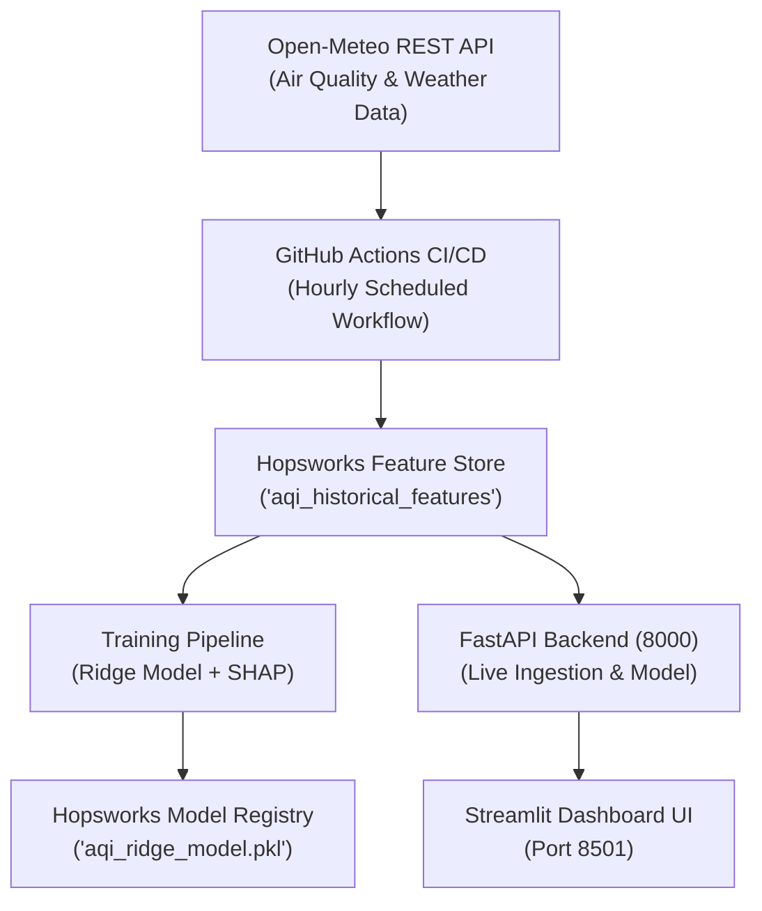

# 🌆 Automated MLOps for Air Quality: Pearls AQI Predictor

---

## 🛰️ Live Dashboard & System Infrastructure

The interactive prediction interface is powered by a two-tier microservices architecture featuring a **FastAPI backend** and a **Streamlit frontend**.

* **Backend Microservice:** FastAPI REST engine running on `http://127.0.0.1:8000`, exposing `/predict` endpoints and loading Hopsworks model weights into memory.
* **Frontend Observatory:** Streamlit UI running on `http://localhost:8501`, featuring dynamic EPA health advisories, interactive Plotly trajectory curves, a 3-day "Haze Horizon" severity band, and live SHAP feature contribution charts.

---

## 📝 Introduction

This repository implements a production-grade, end-to-end MLOps ecosystem designed to forecast Air Quality Index (AQI) trajectories up to **72 hours into the future** for Karachi, Pakistan. By coupling hourly environmental data ingestion with automated cloud pipelines, the system delivers continuous 24, 48, and 72-hour forecast horizons.

Built for modularity and scalability, the system relies on **Hopsworks Cloud** as both a Feature Store (`aqi_historical_features` v2) and Model Registry, **GitHub Actions** for CI/CD scheduled orchestration, a **Ridge Regression** forecasting model, and **SHAP (SHapley Additive exPlanations)** for explainable AI metrics.

---

## ✨ Key Features

* **Automated Hourly Ingestion:** Continuous extraction of atmospheric pollutants ($\text{PM}_{2.5}$, $\text{PM}_{10}$, $\text{CO}$, $\text{NO}_2$, $\text{SO}_2$, $\text{O}_3$) and meteorological variables (temperature, relative humidity, surface pressure, wind speed, precipitation) via the Open-Meteo REST API.
* **Feature Engineering & Leak-Free Horizon:** Computes rolling statistics, rate-of-change metrics, temporal indicators (hour, day, month, day of week), and a strict target variable horizon ($\text{AQI}_{t+72}$) engineered to eliminate data leakage.
* **Feature Store & Model Registry:** Centralized, versioned dataset storage and model artifact tracking (`aqi_ridge_model.pkl`) using Hopsworks Cloud.
* **Automated CI/CD Pipeline:** Scheduled GitHub Actions workflow (`cron: '0 * * * *'`) executing hourly feature ingestion and feature store updates using encrypted secrets.
* **Interpretability & Explainability:** Global and local model decision explanations using SHAP value analysis to quantify exact feature impacts on the 72-hour forecast horizon.
* **Two-Tier Serving Infrastructure:** Decoupled FastAPI backend service delivering low-latency inference to a Streamlit "Atmospheric Observatory" user interface.

---

## ⚙️ How It Works

The system is orchestrated by an automated cloud data pipeline:

### 1. Hourly Data Pipeline (`.github/workflows/feature_pipeline.yml`)
* **Trigger:** Executes automatically at the start of every hour via GitHub Actions cron schedule (`0 * * * *`).
* **Ingestion (`fetch_air_quality.py`):** Fetches real-time Karachi atmospheric pollutant and weather metrics from the Open-Meteo API.
* **Transformation & Storage:** Computes lag features, temporal cycles, and target variables before appending transformed feature vectors into the Hopsworks Cloud Feature Store.

---

## 📂 Repository Structure

```text
Pearls_AQI_Predictor/
├── .github/
│   └── workflows/
│       └── feature_pipeline.yml          # GitHub Actions hourly CI/CD cron job
├── API/
│   └── my_API.py                         # Standalone API test endpoint
├── dashboard_UI/
│   ├── App_dashboard_backend.py          # FastAPI backend server (Port 8000)
│   └── app.py                            # Streamlit Atmospheric Observatory UI (Port 8501)
├── data/                                 # Local feature snapshots and raw historical CSVs
├── feature_pipeline/
│   ├── fetch_air_quality.py              # Real-time hourly data ingestion pipeline
│   ├── backfill_histdata.py              # 2-Year historical backfill script
│   ├── create_features.py               # Feature transformation logic
│   ├── calculate_AQI.py                  # EPA sub-index calculation script
│   └── validating_training_data.py      # Feature validation pipeline
├── notebook/
│   ├── hopsworks_feature_store.ipynb     # Model training, evaluation & Hopsworks sync
│   ├── data/                             # Notebook source data
│   └── model_dir/                        # Serialized SHAP & Ridge artifacts
├── requirements.txt                      # Project dependency definitions
└── README.md                             # Project documentation

🚀 Setup and Usage
Prerequisites
Python 3.10+

A Hopsworks Cloud account and API key

1. Installation
Clone the repository:

Bash
git clone [https://github.com/HuzaifaRizwan-GH/Pearls_AQI_Predictor.git](https://github.com/HuzaifaRizwan-GH/Pearls_AQI_Predictor.git)
cd Pearls_AQI_Predictor
Set up virtual environment:

Bash
# Create environment
python -m venv .venv-1

# Activate on Windows (PowerShell)
.venv-1\Scripts\Activate.ps1

# Install requirements
pip install -r requirements.txt
2. Environment Variables
Create a .env file in the project root and add your Hopsworks API Key:

Code snippet
HOPSWORKS_API_KEY="your_hopsworks_api_key_here"
💻 Manual Execution & Local Microservices
Run the components locally in two separate terminals:

Terminal 1: Launch FastAPI Backend Server
Bash
cd dashboard_UI
python -m uvicorn App_dashboard_backend:app --reload --port 8000
Swagger API UI: http://127.0.0.1:8000/docs

Prediction Endpoint: http://127.0.0.1:8000/predict

Terminal 2: Launch Streamlit Dashboard Frontend
Bash
cd dashboard_UI
python -m streamlit run app.py
Dashboard Interface: http://localhost:8501

🏁 Conclusion
This project delivers a complete MLOps architecture for air quality forecasting. By pairing cloud feature store technology with CI/CD automation, a FastAPI service layer, and SHAP explainability, the system provides automated, interpretable 72-hour AQI projections for Karachi.

✅ Project Status: Production Ready. Automated cloud pipelines, microservice backend APIs, and the Streamlit UI dashboard are operational.

👤 Author & Credits
Developed with ❤️ by Huzaifa Rizwan as part of the 10Pearls Shine Internship Program 2026 - Data Science & MLOps Track.

Developer: Huzaifa Rizwan

Track: Data Science & MLOps

Organization: 10Pearls

If you find this project useful, please consider giving it a ⭐ on GitHub!