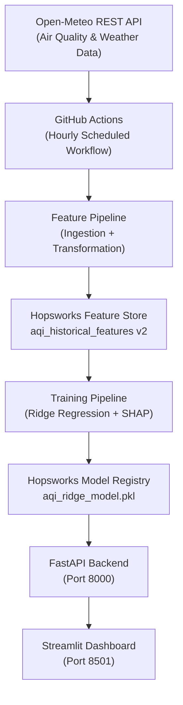

# 🌆 Pearls AQI Predictor

### Automated MLOps for 72-Hour Air Quality Forecasting in Karachi, Pakistan

An end-to-end **Data Science and MLOps project** that automatically collects environmental data, engineers machine-learning features, stores them in a cloud Feature Store, trains an AQI forecasting model, and serves interpretable **24-, 48-, and 72-hour air quality predictions** through a live dashboard.

---

## 🌐 Live Streamlit Cloud Deployment

The interactive Karachi Atmospheric Observatory dashboard is publicly deployed on Streamlit Community Cloud and directly integrated with the Hopsworks Feature Store:

* **Live Dashboard URL:** [https://pearlsaqipredictor-huzaifarizwan.streamlit.app](https://pearlsaqipredictor-huzaifarizwan.streamlit.app)
* **Hosting Platform:** Streamlit Community Cloud (Python 3.11 Runtime)
* **Cloud Architecture:** Standalone microservice fallback with secure TOML secrets management connecting directly to Hopsworks Feature Store.

--- 

## 🛰️ Live Dashboard & System Architecture

The project uses a two-tier microservices architecture consisting of a **FastAPI backend** and a **Streamlit frontend**.

### Backend — FastAPI

The FastAPI service provides the model inference layer.

* Runs locally on `http://127.0.0.1:8000`
* Exposes REST prediction endpoints
* Loads the trained Ridge Regression model
* Retrieves model artifacts from Hopsworks Model Registry
* Provides interactive API documentation through Swagger

### Frontend — Streamlit

The Streamlit application provides the user-facing **Atmospheric Observatory** dashboard.

* Runs locally on `http://localhost:8501`
* Displays 24-, 48-, and 72-hour AQI forecasts
* Provides EPA-based health advisories
* Displays interactive Plotly AQI trajectory charts
* Shows a 3-day **Haze Horizon** severity visualization
* Provides SHAP-based feature contribution explanations

---

# 📝 Introduction

**Pearls AQI Predictor** is a production-oriented MLOps system designed to forecast **Air Quality Index (AQI) up to 72 hours into the future for Karachi, Pakistan**.

The system combines:

* Hourly environmental data ingestion
* Automated feature engineering
* Cloud-based feature storage
* Machine-learning model training
* Model versioning
* CI/CD automation
* REST API model serving
* Interactive visualization
* Explainable AI using SHAP

The project uses **Hopsworks Cloud** as the Feature Store and Model Registry, **GitHub Actions** for automated hourly pipeline execution, a **Ridge Regression** model for forecasting, and **SHAP (SHapley Additive exPlanations)** for model interpretability.

The architecture is designed to be modular, reproducible, and scalable.

---

# ✨ Key Features

### 🌦️ Automated Environmental Data Ingestion

The system automatically collects hourly atmospheric and meteorological data from the **Open-Meteo REST API**, including:

* PM2.5
* PM10
* Carbon Monoxide (CO)
* Nitrogen Dioxide (NO₂)
* Sulfur Dioxide (SO₂)
* Ozone (O₃)
* Temperature
* Relative Humidity
* Surface Pressure
* Wind Speed
* Precipitation

### 🧮 AQI Calculation & Feature Engineering

The pipeline transforms raw environmental data into machine-learning features, including:

* AQI sub-index calculations
* Lag features
* Rolling statistics
* Rate-of-change features
* Temporal features
* Hour of day
* Day of week
* Month
* Cyclical time features
* Future AQI target variables

The feature engineering pipeline is designed to maintain a **leak-free forecasting setup**, ensuring that future information is not accidentally used to predict the present.

### ☁️ Hopsworks Feature Store

Hopsworks Cloud provides centralized and versioned storage for the project's machine-learning features.

Feature Store:

`aqi_historical_features`

Feature Store version:

`v2`

### 🤖 Machine Learning

The forecasting model is based on **Ridge Regression**, providing a lightweight and interpretable baseline suitable for continuous AQI forecasting.

The trained model is stored and versioned through the Hopsworks Model Registry.

Model artifact:

`aqi_ridge_model.pkl`

### 🔄 Automated CI/CD

GitHub Actions automatically executes the feature pipeline every hour using:

`0 * * * *`

The workflow:

1. Retrieves environmental data
2. Processes the incoming data
3. Generates machine-learning features
4. Validates the feature data
5. Updates the Hopsworks Feature Store

### 🔍 Explainable AI

The project integrates **SHAP** to explain model predictions.

The dashboard can display feature contributions showing which environmental variables are influencing the forecast.

This makes the model output more transparent and easier to interpret.

### 🚀 Two-Tier Model Serving

The serving architecture separates inference from visualization:

**Streamlit UI → FastAPI Backend → Trained Model**

This separation makes the system easier to maintain and allows the API to be consumed by other applications in the future.

---

# ⚙️ How It Works



## 🔄 End-to-End Pipeline

### 1. Data Collection

The system retrieves hourly air-quality and weather information from Open-Meteo.

### 2. Automated Pipeline

The GitHub Actions workflow runs automatically at the beginning of every hour.

Workflow:

`.github/workflows/feature_pipeline.yml`

### 3. Feature Engineering

The raw environmental data is transformed into machine-learning features.

The pipeline generates:

* Lagged observations
* Rolling averages/statistics
* Rate-of-change measurements
* Temporal indicators
* Cyclical time features
* AQI target variables

### 4. Feature Store

The processed features are uploaded to the Hopsworks Feature Store:

`aqi_historical_features`

### 5. Model Training

The training notebook retrieves the feature data and trains the Ridge Regression forecasting model.

Model evaluation includes standard regression metrics such as:

* MAE
* RMSE
* R²

### 6. Model Registry

The trained model is serialized and stored in the Hopsworks Model Registry as:

`aqi_ridge_model.pkl`

### 7. Model Serving

The FastAPI backend loads the trained model and exposes the prediction service through a REST API.

### 8. Dashboard

The Streamlit frontend communicates with the FastAPI backend and presents the predictions through an interactive dashboard.

---

# 📂 Repository Structure

```text
Pearls_AQI_Predictor/
│
├── .github/
│   └── workflows/
│       └── feature_pipeline.yml          # GitHub Actions hourly CI/CD cron job
│
├── API/
│   └── my_API.py                         # Standalone REST API test endpoint
│
├── dashboard_UI/
│   ├── .streamlit/                       # Local Streamlit config & secrets (Git-ignored)
│   ├── App_dashboard_backend.py          # FastAPI backend microservice (Port 8000)
│   └── app.py                            # Streamlit Atmospheric Observatory UI (Port 8501)
│
├── data/                                 # Local CSV data snapshots
│   ├── aqi_features.csv
│   ├── features.csv
│   ├── historical_aqi_features.csv
│   ├── historical_features.csv
│   ├── historical_raw_data.csv
│   └── raw_data.csv
│
├── feature_pipeline/                     # Core Data Engineering Modules
│   ├── backfill_2year_data.py            # Hopsworks Feature Store 2-Year Hudi backfill script
│   ├── backfill_histdata.py              # Historical data extraction logic
│   ├── calculate_AQI.py                  # EPA sub-index calculation script
│   ├── calculate_historical_AQI.py       # Historical AQI processing
│   ├── create_features.py               # Feature transformation and lag generation
│   ├── creating_historical_features.py  # Historical feature construction
│   ├── fetch_air_quality.py              # Real-time hourly Open-Meteo REST API ingestion
│   └── validating_training_data.py      # Feature validation pipeline
│
├── models/                               # Local model storage directory
│
├── notebook/                             # Research & Model Development
│   ├── hopsworks_feature_store.ipynb     # EDA, training, baseline evaluation & Hopsworks sync
│   ├── data/                             # Notebook source data
│   └── model_dir/                        # Serialized model & SHAP artifacts
│
├── training_pipeline/                    # Retraining pipeline modules
│
├── .env                                  # Environment variables (Git-ignored)
├── .gitignore                             # Git ignore rules
├── requirements.txt                      # Project python dependency definitions
└── README.md                             # Production project documentation
```

---

# 🚀 Setup & Usage

## Prerequisites

Before running the project, make sure you have:

* Python **3.10 or later**
* Git
* A Hopsworks Cloud account
* A Hopsworks API key

---

## 1. Clone the Repository

```bash
git clone https://github.com/HuzaifaRizwan-GH/Pearls_AQI_Predictor.git

cd Pearls_AQI_Predictor
```

---

## 2. Create a Virtual Environment

### Windows PowerShell

```powershell
python -m venv .venv-1
```

Activate the environment:

```powershell
.venv-1\Scripts\Activate.ps1
```

---

## 3. Install Dependencies

```bash
pip install -r requirements.txt
```

---

# 🔐 Environment Variables

Create a `.env` file in the project root directory.

Add your Hopsworks API key:

```env
HOPSWORKS_API_KEY="your_hopsworks_api_key_here"
```

> ⚠️ **Important:** Never commit your `.env` file or API keys to GitHub.

Make sure `.env` is included in your `.gitignore` file.

Example:

```text
.env
.venv/
__pycache__/
*.pyc
```

---

# 💻 Running the Application Locally

The application consists of two services:

1. FastAPI backend
2. Streamlit frontend

Run each service in a separate terminal.

---

## Terminal 1 — FastAPI Backend

Navigate to the dashboard directory:

```bash
cd dashboard_UI
```

Start the FastAPI server:

```bash
python -m uvicorn App_dashboard_backend:app --reload --port 8000
```

The API will be available at:

`http://127.0.0.1:8000`

### Swagger API Documentation

Open:

`http://127.0.0.1:8000/docs`

### Prediction Endpoint

```text
POST /predict
```

---

## Terminal 2 — Streamlit Dashboard

From the `dashboard_UI` directory:

```bash
python -m streamlit run app.py
```

The dashboard will be available at:

`http://localhost:8501`

---

# 🔄 GitHub Actions Automation

The project includes an automated GitHub Actions workflow:

```text
.github/workflows/feature_pipeline.yml
```

The workflow is scheduled to run every hour:

```yaml
cron: '0 * * * *'
```

The automated process:

```text
Open-Meteo
    ↓
Data Ingestion
    ↓
Feature Engineering
    ↓
Data Validation
    ↓
Hopsworks Feature Store
```

This allows the Feature Store to continuously receive updated environmental observations without requiring manual execution.

---

# 📊 Model Evaluation

The forecasting model can be evaluated using standard regression metrics.

### MAE — Mean Absolute Error

Measures the average absolute difference between predicted and actual AQI values.

Lower MAE indicates better prediction accuracy.

### RMSE — Root Mean Squared Error

Measures prediction error while giving greater weight to larger errors.

Lower RMSE indicates better performance.

### R² — Coefficient of Determination

Measures how well the model explains the variation in the target variable.

Values closer to `1.0` generally indicate better explanatory performance.

---

# 🔍 Explainability with SHAP

The project uses **SHAP (SHapley Additive exPlanations)** to provide insight into model predictions.

Instead of displaying only the predicted AQI, the dashboard can show which features contributed to the prediction.

For example, environmental variables such as:

* PM2.5
* PM10
* Temperature
* Relative Humidity
* Wind Speed
* NO₂
* O₃

can be analyzed to understand their influence on the forecast.

This improves model transparency and helps users understand **why** the model produced a particular prediction.

---

# 🏗️ Technology Stack

| Component            | Technology       |
| -------------------- | ---------------- |
| Programming Language | Python           |
| Data Source          | Open-Meteo API   |
| Data Processing      | Pandas           |
| Machine Learning     | Scikit-learn     |
| Forecasting Model    | Ridge Regression |
| Explainable AI       | SHAP             |
| Feature Store        | Hopsworks        |
| Model Registry       | Hopsworks        |
| Backend API          | FastAPI          |
| Frontend             | Streamlit        |
| Visualization        | Plotly           |
| Automation           | GitHub Actions   |
| Version Control      | Git / GitHub     |

---

# 🎯 Project Goals

The primary goals of Pearls AQI Predictor are to demonstrate how a machine-learning model can be transformed into an automated production-style system.

The project focuses on:

* Automated data pipelines
* Reproducible feature engineering
* Cloud Feature Store usage
* Model versioning
* CI/CD automation
* API-based model serving
* Interactive visualization
* Explainable AI
* 72-hour forecasting

---

# 🏁 Conclusion

**Pearls AQI Predictor** demonstrates a complete end-to-end MLOps workflow for air-quality forecasting.

The system connects automated environmental data ingestion, feature engineering, cloud Feature Store management, machine-learning model training, model registration, CI/CD automation, API-based inference, and explainable AI into a single architecture.

The final system provides automated **24-, 48-, and 72-hour AQI forecasts for Karachi**, presented through an interactive Streamlit dashboard and served through a FastAPI inference layer.

---

# 👤 Author & Credits

Developed with ❤️ by **Huzaifa Rizwan** as part of the **10Pearls Shine Internship Program 2026 — Data Science & MLOps Track**.

**Developer:** Huzaifa Rizwan
**Track:** Data Science & MLOps
**Organization:** 10Pearls
**Project:** Pearls AQI Predictor

---

## ⭐ Support the Project

If you find this project useful or interesting, consider giving the repository a ⭐ on GitHub!

**Built with Python, MLOps, and a goal of making air-quality forecasting more accessible. 🌍**
